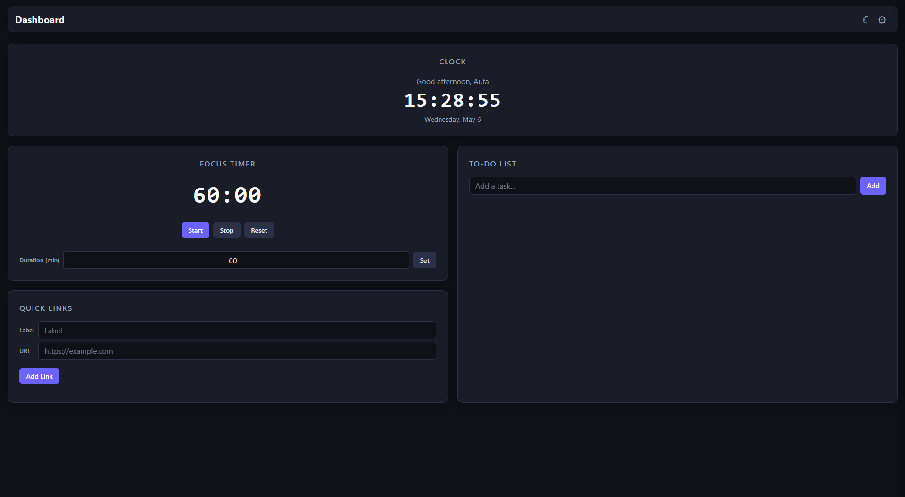

## Overview

**Todo-List Live Dashboard** is a modern web app design to improve daily productivity by combining:

* Task management
* Focus timer (Pomodoro)
* Quick access links
* Light/Dark theme

All features are packed into one interactive dashboard without page reloads, providing a fast and efficient user experience.

---

## Live Preview

<p align="center">
  
</p>

---

## Tech Stack

| Technology   | Description                |
| ------------ | -------------------------- |
| HTML5        | Struktur aplikasi          |
| Tailwind CSS | Styling modern & responsif |
| JavaScript   | Logic & interactivity      |

---

## Project Structure

```
todo-list-live-dashboard/
├── index.html
├── css/
├   └── style.css
├── js/
├   └── script.js
├── assets/
│   └── preview.png
```

---

## Live Demo

🌐 https://aufa18.github.io/CodingCamp-4May26-Aufa/

---

## Roadmap Next Features

* [ ] Drag & Drop Todo
* [ ] Authentication System
* [ ] Backend Integration (Laravel / Firebase)

---

## Author

👨‍💻 **Aufa Wicaksono**
